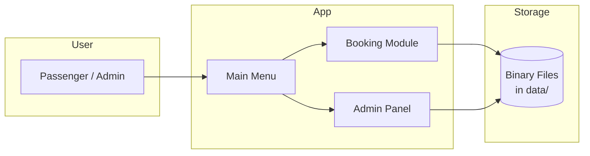
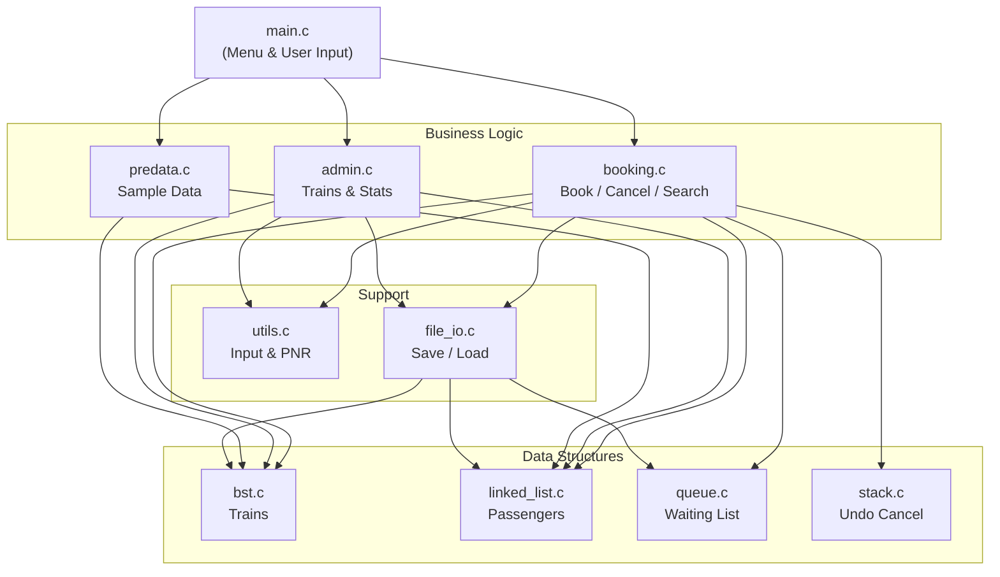
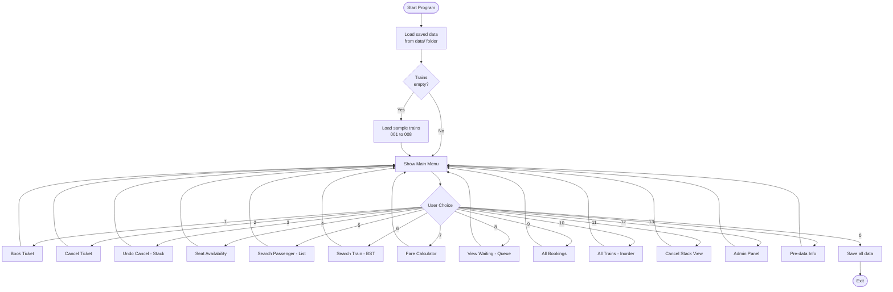
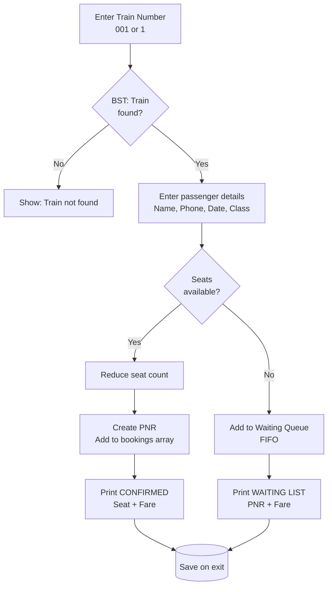
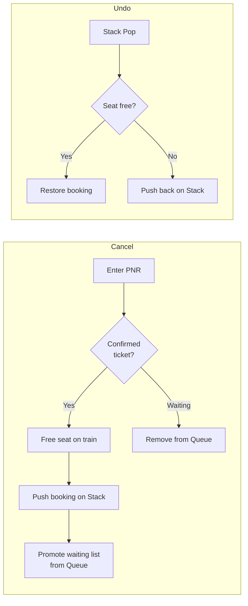
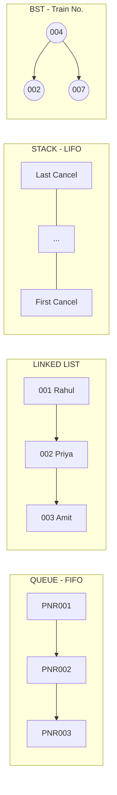

# Railway Reservation System

> Console-based ticket booking system in **C** using **Queue, Linked List, Stack, and BST**  
> Author: **Hariom** | [hariom-devx/railway-reservation-system](https://github.com/hariom-devx/railway-reservation-system)

---

## Table of Contents

1. [Overview](#overview)
2. [System Architecture](#system-architecture)
3. [Program Flow](#program-flow)
4. [Booking Flow](#booking-flow)
5. [Data Structures Map](#data-structures-map)
6. [Features](#features)
7. [Quick Start](#quick-start)
8. [Test Data](#test-data)
9. [Project Structure](#project-structure)
10. [Documentation](#documentation)

---

## Overview



| Item | Detail |
|------|--------|
| Language | C (C11) |
| Build | Makefile |
| Interface | Menu-driven console |
| Persistence | `fread` / `fwrite` in `data/` folder |

---

## System Architecture

How all modules connect:



---

## Program Flow

From start to exit:



---

## Booking Flow



### Cancel and Undo Flow



---

## Data Structures Map



| Data Structure | File | Real Use in Project |
|----------------|------|---------------------|
| **Queue** | `queue.c` | Waiting list when train is full |
| **Linked List** | `linked_list.c` | Passenger records |
| **Stack** | `stack.c` | Undo last cancellation |
| **BST** | `bst.c` | Train search by number `001`, `002`... |

---

## Features

| # | Feature | Data Structure |
|---|---------|----------------|
| 1 | Book ticket | BST + Array |
| 2 | Cancel ticket | BST + Stack |
| 3 | Undo cancel | Stack |
| 4 | Seat availability | BST |
| 5 | Search passenger | Linked List |
| 6 | Search train | BST |
| 7 | Fare calculator | BST |
| 8 | Waiting list | Queue |
| 9 | View bookings | Array |
| 10 | View all trains | BST inorder |
| 11 | View cancel stack | Stack |
| 12 | Admin panel | BST + List |
| 13 | Pre-data info | — |
| 0 | Save and exit | File I/O |

---

## Quick Start

```bash
git clone https://github.com/hariom-devx/railway-reservation-system.git
cd railway-reservation-system
make
./railway_system
```

Reset and run with fresh sample data:

```bash
make reset && make run
```

| Admin Login | Value |
|-------------|-------|
| Username | `admin` |
| Password | `admin123` |

---

## Test Data

| Train | Name | Route |
|:-----:|------|-------|
| **001** | Rajdhani Express | Mumbai → Delhi |
| **002** | Karnataka Express | Bangalore → Delhi |
| **003** | Howrah Rajdhani | Kolkata → Delhi |
| **004** | Shatabdi Express | Mumbai → Ahmedabad |
| **005** | Tamil Nadu Express | Chennai → Delhi |
| **006** | Goa Express | Mumbai → Goa |
| **007** | Coromandel Express | Chennai → Kolkata |
| **008** | Duronto Express | Delhi → Kolkata |

**Passengers:** `001` – `005`  
**Sample PNR:** `PNR001` – `PNR005` (`PNR005` = waiting list)

> Tip: Type train `1` or `001` — both work.

---

## Project Structure

```
railway-reservation-system/
│
├── include/              Headers
│   ├── types.h             Structures
│   ├── bst.h               Train BST
│   ├── queue.h             Waiting list
│   ├── stack.h             Undo stack
│   ├── linked_list.h       Passengers
│   ├── booking.h           Core system
│   ├── admin.h             Admin panel
│   ├── file_io.h           File save/load
│   ├── predata.h           Sample data
│   └── utils.h             Helpers
│
├── src/                    Source code
│   ├── main.c              Entry + menu
│   ├── booking.c           Tickets
│   ├── bst.c               Trains
│   ├── queue.c             Waiting
│   ├── stack.c             Undo
│   ├── linked_list.c       Passengers
│   ├── admin.c             Admin
│   ├── file_io.c           Files
│   ├── predata.c           Demo data
│   └── utils.c             Input/PNR
│
├── data/                   Saved .dat files
├── docs/                   Reports & diagrams
├── Makefile
├── run.sh
└── README.md
```

---

## Documentation

| Document | Description |
|----------|-------------|
| [Flow Diagrams (detailed)](docs/FLOW_DIAGRAM.md) | All diagrams in one page |
| [Compilation Guide](docs/COMPILATION.md) | Build on Windows/Linux/Mac |
| [Project Report](docs/PROJECT_REPORT.md) | Report summary |
| [Pre-loaded Data](docs/PREDATA.md) | Test trains & PNR |
| [Sample Output](docs/SAMPLE_OUTPUT.md) | Console examples |

---

## Fare Formula

```
Fare = Distance (km) × Fare per km × Class multiplier
```

| Class | Code | Multiplier |
|-------|:----:|:----------:|
| Sleeper | 1 | 1.0 |
| AC 3-Tier | 2 | 1.8 |
| AC 2-Tier | 3 | 2.5 |
| AC First | 4 | 4.0 |

---

## License

MIT License — free for educational use.
