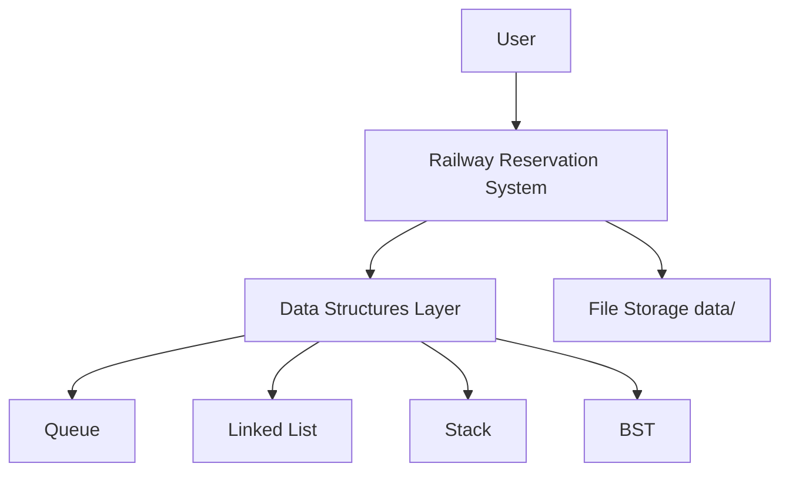
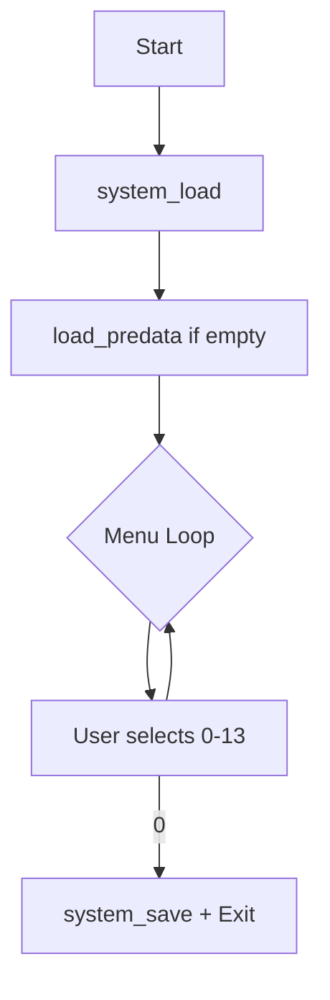
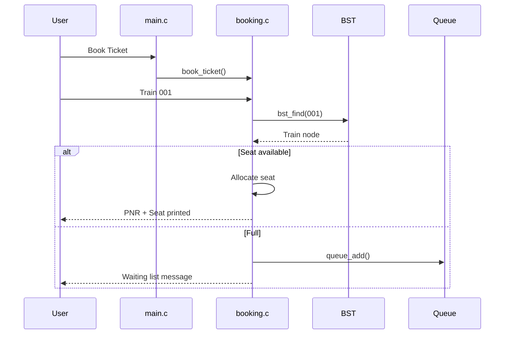
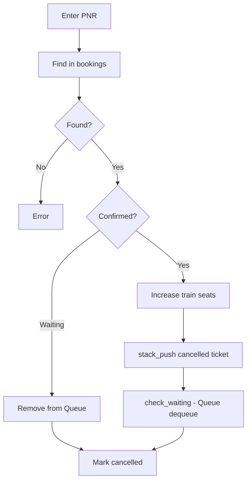
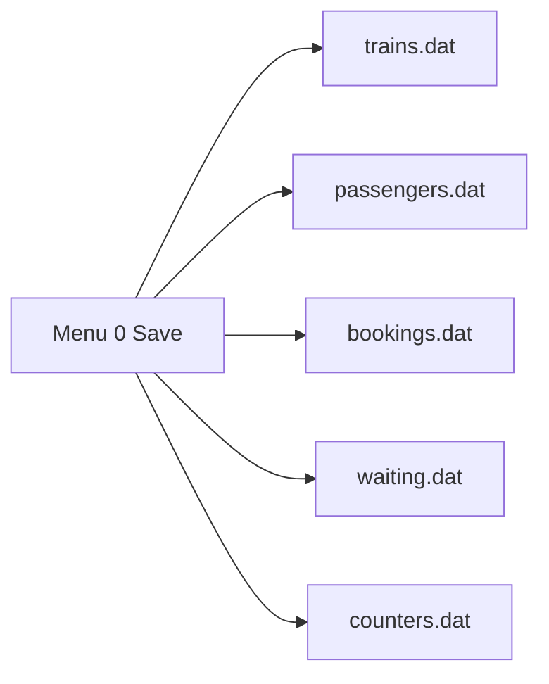
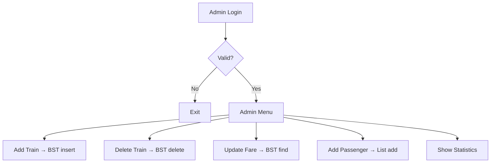
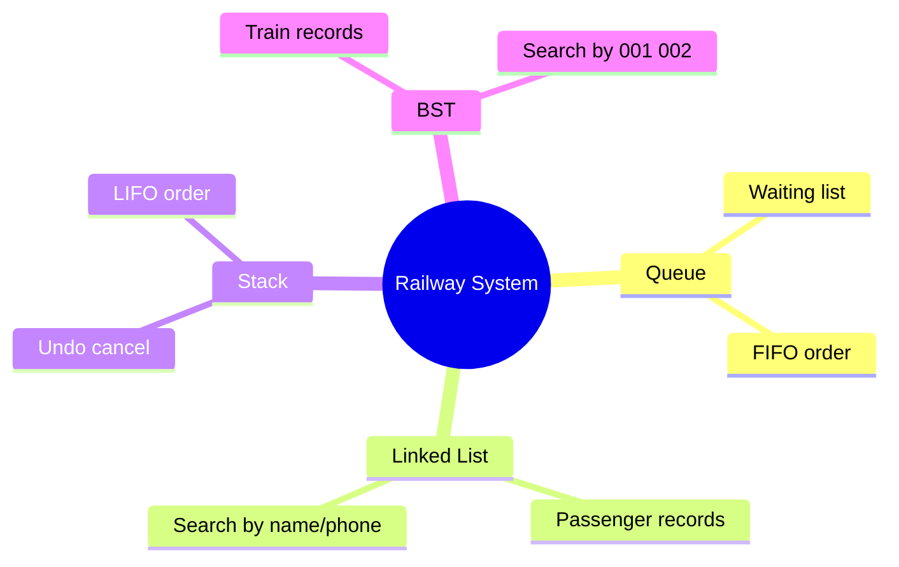

# Railway Reservation System — Flow Diagrams

Use this page for project report, PPT, or viva explanation.

---

## 1. High-Level System

---

## 2. Main Menu Flow

---

## 3. Ticket Booking — Step by Step

| Step | Action |
|:----:|--------|
| 1 | User enters train number |
| 2 | BST search by train number |
| 3 | Enter name, phone, date, class |
| 4 | Calculate fare |
| 5 | If seat available → confirm |
| 6 | If full → add to Queue |
| 7 | Store in bookings array |

---

## 4. Cancellation Flow

---

## 5. File Save Flow (on Exit)

---

## 6. Admin Panel Flow

---

## 7. Data Structure — Where Used

---

Back to [README](../README.md)
